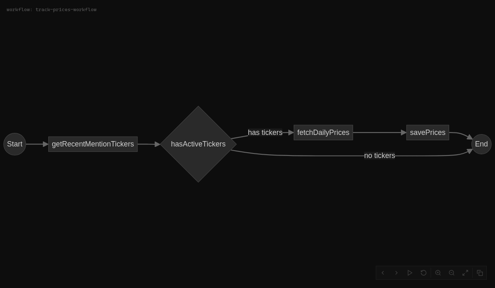
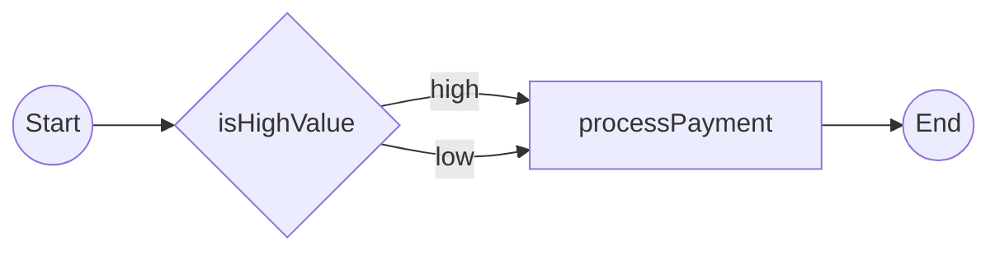

# temporalio-graphs

Generate workflow graphs for [Temporal](https://temporal.io) by running workflows in mocked-execution mode.

> **TypeScript port of [Temporalio.Graphs](https://github.com/oleg-shilo/Temporalio.Graphs) by [Oleg Shilo](https://github.com/oleg-shilo)**
>
> The original .NET library provides an elegant approach to visualizing Temporal workflows by executing them in a mocked environment and capturing the execution graph. This TypeScript implementation brings the same capabilities to the Node.js ecosystem.



## Features

- Generate complete workflow DAGs without running actual activities
- Capture all decision branches via automatic permutation
- Output Mermaid flowchart syntax
- Interactive HTML viewer with pan/zoom and step-by-step animation
- Support for child workflow visualization

## Installation

```bash
npm install temporalio-graphs
```

## Quick Start

### 1. Define Your Activities with Decision Points

Use the `@Decision` decorator to mark activities that represent branching decisions:

```typescript
import { Decision } from 'temporalio-graphs';

export class MyActivities {
  @Decision({ positiveLabel: 'high', negativeLabel: 'low' })
  async isHighValue(amount: number): Promise<boolean> {
    return amount > 10000;
  }

  async processPayment(amount: number): Promise<void> {
    // Process payment logic
  }
}
```

### 2. Build the Graph

Create a build script that uses `createMockActivities` to mock your activities during graph generation:

```typescript
import { buildGraph, generateViewerHtml, createMockActivities } from 'temporalio-graphs';
import { MyActivities } from './activities';
import * as fs from 'fs';

// Create mock activities for graph building
const activitiesInstance = new MyActivities();
const activities = createMockActivities<MyActivities>({
  activitiesClass: activitiesInstance,
});

// Define workflow using mock activities
async function myWorkflow(input: { amount: number }): Promise<void> {
  if (await activities.isHighValue(input.amount)) {
    // High value path
  }
  await activities.processPayment(input.amount);
}

// Build the graph
const result = await buildGraph(myWorkflow, {
  workflowArgs: [{ amount: 5000 }],
  splitNamesByWords: true,
});

// Output Mermaid syntax
console.log(result.mermaid);

// Generate interactive HTML viewer
const html = generateViewerHtml(result.mermaid, 'My Workflow');
fs.writeFileSync('workflow.html', html);
```

## Output Example



## Using with Temporal Runtime

For use within actual Temporal workers, export the interceptors from your workflows file:

```typescript
import { createGraphBuildingInterceptors } from 'temporalio-graphs';

export const interceptors = createGraphBuildingInterceptors();
```

## API Reference

### `buildGraph(workflow, options)`

Builds a workflow graph by running the workflow in mocked-execution mode.

**Options:**
- `workflowArgs`: Arguments to pass to the workflow
- `maxDecisions`: Maximum decision points to explore (default: 10)
- `splitNamesByWords`: Split camelCase names for readability

**Returns:** `GraphResult` with `paths`, `edges`, `mermaid`, `pathDescriptions`

### `createMockActivities<T>(options?)`

Creates mock activity proxies for graph building mode. This is the key function for generating graphs outside the Temporal runtime.

**Options:**
- `activitiesClass`: Instance of your activities class (used to detect @Decision decorators)

### `@Decision(options?)`

Decorator to mark an activity as a decision point.

**Options:**
- `positiveLabel`: Label for true branch (default: 'yes')
- `negativeLabel`: Label for false branch (default: 'no')

### `toDecision(condition, label, options?)`

Wrapper for inline boolean conditions in workflows.

### `generateViewerHtml(mermaid, title?)`

Generates an interactive HTML viewer for the workflow graph.

### `createGraphBuildingInterceptors()`

Creates workflow interceptors for graph building mode (for use with Temporal runtime).

## Design Decisions

### Decision Point Marking

We use `@Decision` decorator + `toDecision()` wrapper (matching the .NET implementation) because:

1. **Parity with .NET** - Familiar patterns for Temporalio.Graphs users
2. **Explicit over implicit** - Decision points are architectural choices
3. **Covers both use cases** - Activities and inline conditions
4. **Type-safe** - Full TypeScript support
5. **No magic** - Clear developer intent

## Examples

See the `examples/` directory:
- `money-transfer/` - Port of the original .NET example
- `fintech-pipeline/` - Simplified daily pipeline example

To run an example:

```bash
cd examples/money-transfer
npm install
npm run graph
open workflow.html
```

## License

MIT - Based on [Temporalio.Graphs](https://github.com/oleg-shilo/Temporalio.Graphs) by Oleg Shilo.
