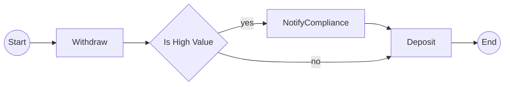

# Temporalio-Graphs TypeScript Port Implementation Plan

> **For Claude:** REQUIRED SUB-SKILL: Use superpowers:executing-plans to implement this plan task-by-task.

**Goal:** Port Temporalio.Graphs from .NET to TypeScript, enabling workflow graph visualization for Temporal workflows via interceptor-based activity mocking.

**Architecture:** A workflow outbound interceptor captures activity and child workflow calls during "graph building mode", mocking their execution while recording the call graph. Decision points (marked via `@Decision` decorator or `toDecision()` wrapper) trigger multiple execution permutations to capture all branches. Output is Mermaid flowchart syntax with an optional interactive HTML viewer.

**Tech Stack:** TypeScript, Temporal SDK ^1.14.0, Vitest, Mermaid.js (bundled), Node 20+, ESM

---

## Phase 1: Project Foundation

### Task 1: Initialize Project

**Files:**
- Create: `package.json`
- Create: `tsconfig.json`
- Create: `.gitignore`
- Create: `LICENSE`

**Step 1: Initialize git repository**

```bash
cd /home/mavdi/Documents/work/temporalio-graphs
git init
```

**Step 2: Create package.json**

```json
{
  "name": "temporalio-graphs",
  "version": "0.1.0",
  "description": "Generate workflow graphs for Temporal by running workflows in mocked-execution mode",
  "type": "module",
  "main": "dist/index.js",
  "types": "dist/index.d.ts",
  "exports": {
    ".": {
      "import": "./dist/index.js",
      "types": "./dist/index.d.ts"
    },
    "./viewer": {
      "import": "./dist/viewer/index.js",
      "types": "./dist/viewer/index.d.ts"
    }
  },
  "files": [
    "dist",
    "viewer.html"
  ],
  "scripts": {
    "build": "tsc",
    "test": "vitest",
    "test:run": "vitest run",
    "lint": "eslint src --ext .ts",
    "prepublishOnly": "npm run build"
  },
  "keywords": [
    "temporal",
    "workflow",
    "graph",
    "visualization",
    "mermaid",
    "dag"
  ],
  "author": "Mark Avdi",
  "license": "MIT",
  "repository": {
    "type": "git",
    "url": "https://github.com/mavdi/temporalio-graphs.git"
  },
  "engines": {
    "node": ">=20"
  },
  "peerDependencies": {
    "@temporalio/client": "^1.14.0",
    "@temporalio/worker": "^1.14.0",
    "@temporalio/workflow": "^1.14.0"
  },
  "devDependencies": {
    "@temporalio/client": "^1.14.0",
    "@temporalio/testing": "^1.14.0",
    "@temporalio/worker": "^1.14.0",
    "@temporalio/workflow": "^1.14.0",
    "@types/node": "^22.0.0",
    "typescript": "^5.9.0",
    "vitest": "^4.0.0",
    "eslint": "^8.57.0",
    "@typescript-eslint/eslint-plugin": "^8.0.0",
    "@typescript-eslint/parser": "^8.0.0"
  }
}
```

**Step 3: Create tsconfig.json**

```json
{
  "compilerOptions": {
    "target": "ES2022",
    "module": "NodeNext",
    "moduleResolution": "NodeNext",
    "lib": ["ES2022"],
    "outDir": "./dist",
    "rootDir": "./src",
    "strict": true,
    "esModuleInterop": true,
    "skipLibCheck": true,
    "forceConsistentCasingInFileNames": true,
    "declaration": true,
    "declarationMap": true,
    "sourceMap": true,
    "experimentalDecorators": true,
    "emitDecoratorMetadata": true
  },
  "include": ["src/**/*"],
  "exclude": ["node_modules", "dist", "**/*.test.ts"]
}
```

**Step 4: Create .gitignore**

```
node_modules/
dist/
*.log
.DS_Store
coverage/
.env
```

**Step 5: Create LICENSE**

```
MIT License

Copyright (c) 2025 Mark Avdi

Permission is hereby granted, free of charge, to any person obtaining a copy
of this software and associated documentation files (the "Software"), to deal
in the Software without restriction, including without limitation the rights
to use, copy, modify, merge, publish, distribute, sublicense, and/or sell
copies of the Software, and to permit persons to whom the Software is
furnished to do so, subject to the following conditions:

The above copyright notice and this permission notice shall be included in all
copies or substantial portions of the Software.

THE SOFTWARE IS PROVIDED "AS IS", WITHOUT WARRANTY OF ANY KIND, EXPRESS OR
IMPLIED, INCLUDING BUT NOT LIMITED TO THE WARRANTIES OF MERCHANTABILITY,
FITNESS FOR A PARTICULAR PURPOSE AND NONINFRINGEMENT. IN NO EVENT SHALL THE
AUTHORS OR COPYRIGHT HOLDERS BE LIABLE FOR ANY CLAIM, DAMAGES OR OTHER
LIABILITY, WHETHER IN AN ACTION OF CONTRACT, TORT OR OTHERWISE, ARISING FROM,
OUT OF OR IN CONNECTION WITH THE SOFTWARE OR THE USE OR OTHER DEALINGS IN THE
SOFTWARE.
```

**Step 6: Install dependencies**

```bash
npm install
```

**Step 7: Commit**

```bash
git add -A
git commit -m "chore: initialize project with package.json, tsconfig, license"
```

---

### Task 2: Create Source Directory Structure

**Files:**
- Create: `src/index.ts`
- Create: `src/types.ts`
- Create: `src/context.ts`

**Step 1: Create types.ts with core interfaces**

```typescript
// src/types.ts

/**
 * Configuration for graph building mode
 */
export interface GraphBuildingContext {
  /** Whether graph building mode is active */
  isBuildingGraph: boolean;
  /** Exit worker after graph is built */
  exitAfterBuildingGraph?: boolean;
  /** Output file path for generated graph */
  graphOutputFile?: string;
  /** Split camelCase activity names into words */
  splitNamesByWords?: boolean;
  /** Output only Mermaid syntax (no paths) */
  mermaidOnly?: boolean;
  /** Maximum depth for child workflow recursion (default: 10) */
  maxChildDepth?: number;
}

/**
 * Represents a single node in the workflow graph
 */
export interface GraphNode {
  id: string;
  name: string;
  type: 'activity' | 'decision' | 'childWorkflow' | 'start' | 'end';
  /** For decisions: the branch taken (yes/no) */
  branch?: string;
  /** For child workflows: the child workflow type */
  childWorkflowType?: string;
}

/**
 * Represents an edge between two nodes
 */
export interface GraphEdge {
  source: string;
  target: string;
  label?: string;
}

/**
 * A complete execution path through the workflow
 */
export type GraphPath = GraphNode[];

/**
 * Result of graph generation
 */
export interface GraphResult {
  /** All captured execution paths */
  paths: GraphPath[];
  /** Unique edges in the graph */
  edges: GraphEdge[];
  /** Mermaid syntax output */
  mermaid: string;
  /** Human-readable path descriptions */
  pathDescriptions: string[];
}

/**
 * Metadata stored on decision-marked activities
 */
export interface DecisionMetadata {
  positiveLabel?: string;
  negativeLabel?: string;
}

/**
 * Symbol key for storing decision metadata */
export const DECISION_METADATA_KEY = Symbol('temporalio-graphs:decision');
```

**Step 2: Create context.ts for runtime context management**

```typescript
// src/context.ts

import type { GraphBuildingContext, GraphNode } from './types.js';

/**
 * Global context for graph building - accessed by interceptor and decorators
 */
class GraphContext {
  private _context: GraphBuildingContext | null = null;
  private _currentPath: GraphNode[] = [];
  private _allPaths: GraphNode[][] = [];
  private _decisionIndex = 0;
  private _decisionPlan: boolean[] = [];

  get isBuildingGraph(): boolean {
    return this._context?.isBuildingGraph ?? false;
  }

  get context(): GraphBuildingContext | null {
    return this._context;
  }

  set context(ctx: GraphBuildingContext | null) {
    this._context = ctx;
  }

  get currentPath(): GraphNode[] {
    return this._currentPath;
  }

  get allPaths(): GraphNode[][] {
    return this._allPaths;
  }

  get decisionPlan(): boolean[] {
    return this._decisionPlan;
  }

  set decisionPlan(plan: boolean[]) {
    this._decisionPlan = plan;
    this._decisionIndex = 0;
  }

  /**
   * Get next decision result from the plan
   */
  getNextDecision(): boolean {
    if (this._decisionIndex >= this._decisionPlan.length) {
      // Default to true if we run out of planned decisions
      return true;
    }
    return this._decisionPlan[this._decisionIndex++];
  }

  /**
   * Add a node to the current execution path
   */
  addNode(node: GraphNode): void {
    this._currentPath.push(node);
  }

  /**
   * Save current path and reset for next permutation
   */
  savePath(): void {
    if (this._currentPath.length > 0) {
      this._allPaths.push([...this._currentPath]);
    }
    this._currentPath = [];
    this._decisionIndex = 0;
  }

  /**
   * Reset all state
   */
  reset(): void {
    this._context = null;
    this._currentPath = [];
    this._allPaths = [];
    this._decisionIndex = 0;
    this._decisionPlan = [];
  }
}

export const graphContext = new GraphContext();
```

**Step 3: Create index.ts entry point (stub)**

```typescript
// src/index.ts

export * from './types.js';
export { graphContext } from './context.js';

// Will export more as we build:
// export { GraphBuilder } from './interceptor/index.js';
// export { Decision, toDecision } from './decorators/index.js';
// export { generateGraph, buildGraph } from './builder/index.js';
```

**Step 4: Verify build works**

```bash
npm run build
```

Expected: Compiles without errors, creates `dist/` directory

**Step 5: Commit**

```bash
git add -A
git commit -m "feat: add core types and context management"
```

---

## Phase 2: Decision Marking

### Task 3: Create @Decision Decorator

**Files:**
- Create: `src/decorators/decision.ts`
- Create: `src/decorators/index.ts`
- Create: `src/decorators/decision.test.ts`

**Step 1: Write the failing test**

```typescript
// src/decorators/decision.test.ts

import { describe, it, expect } from 'vitest';
import { Decision, getDecisionMetadata, isDecision } from './decision.js';

describe('Decision decorator', () => {
  it('marks a function as a decision', () => {
    class TestActivities {
      @Decision()
      async isHighValue(amount: number): Promise<boolean> {
        return amount > 1000;
      }
    }

    const activities = new TestActivities();
    expect(isDecision(activities, 'isHighValue')).toBe(true);
  });

  it('stores custom labels', () => {
    class TestActivities {
      @Decision({ positiveLabel: 'Approved', negativeLabel: 'Rejected' })
      async checkApproval(): Promise<boolean> {
        return true;
      }
    }

    const activities = new TestActivities();
    const metadata = getDecisionMetadata(activities, 'checkApproval');
    expect(metadata?.positiveLabel).toBe('Approved');
    expect(metadata?.negativeLabel).toBe('Rejected');
  });

  it('uses yes/no as default labels', () => {
    class TestActivities {
      @Decision()
      async shouldProceed(): Promise<boolean> {
        return true;
      }
    }

    const activities = new TestActivities();
    const metadata = getDecisionMetadata(activities, 'shouldProceed');
    expect(metadata?.positiveLabel).toBe('yes');
    expect(metadata?.negativeLabel).toBe('no');
  });
});
```

**Step 2: Run test to verify it fails**

```bash
npx vitest run src/decorators/decision.test.ts
```

Expected: FAIL - module not found

**Step 3: Write minimal implementation**

```typescript
// src/decorators/decision.ts

import { DECISION_METADATA_KEY, type DecisionMetadata } from '../types.js';

export interface DecisionOptions {
  positiveLabel?: string;
  negativeLabel?: string;
}

/**
 * Decorator to mark an activity as a decision point.
 * Decision activities must return boolean and will trigger
 * branch exploration during graph building.
 *
 * @example
 * ```typescript
 * class MyActivities {
 *   @Decision()
 *   async isHighValue(amount: number): Promise<boolean> {
 *     return amount > 10000;
 *   }
 *
 *   @Decision({ positiveLabel: 'Approved', negativeLabel: 'Rejected' })
 *   async checkApproval(): Promise<boolean> {
 *     return true;
 *   }
 * }
 * ```
 */
export function Decision(options?: DecisionOptions): MethodDecorator {
  return function (
    target: object,
    propertyKey: string | symbol,
    descriptor: PropertyDescriptor
  ) {
    const metadata: DecisionMetadata = {
      positiveLabel: options?.positiveLabel ?? 'yes',
      negativeLabel: options?.negativeLabel ?? 'no',
    };

    // Store metadata on the class prototype
    const metadataMap: Map<string | symbol, DecisionMetadata> =
      Reflect.getOwnMetadata(DECISION_METADATA_KEY, target) ?? new Map();

    metadataMap.set(propertyKey, metadata);
    Reflect.defineMetadata(DECISION_METADATA_KEY, metadataMap, target);

    return descriptor;
  };
}

/**
 * Check if a method on an object is marked as a decision
 */
export function isDecision(obj: object, methodName: string): boolean {
  const metadataMap: Map<string, DecisionMetadata> | undefined =
    Reflect.getOwnMetadata(DECISION_METADATA_KEY, Object.getPrototypeOf(obj));
  return metadataMap?.has(methodName) ?? false;
}

/**
 * Get decision metadata for a method
 */
export function getDecisionMetadata(
  obj: object,
  methodName: string
): DecisionMetadata | undefined {
  const metadataMap: Map<string, DecisionMetadata> | undefined =
    Reflect.getOwnMetadata(DECISION_METADATA_KEY, Object.getPrototypeOf(obj));
  return metadataMap?.get(methodName);
}
```

**Step 4: Add reflect-metadata dependency**

```bash
npm install reflect-metadata
```

Update `src/index.ts` to import it:

```typescript
// src/index.ts
import 'reflect-metadata';

export * from './types.js';
export { graphContext } from './context.js';
export { Decision, isDecision, getDecisionMetadata } from './decorators/index.js';
```

**Step 5: Create decorators index**

```typescript
// src/decorators/index.ts

export { Decision, isDecision, getDecisionMetadata } from './decision.js';
export type { DecisionOptions } from './decision.js';
```

**Step 6: Run test to verify it passes**

```bash
npx vitest run src/decorators/decision.test.ts
```

Expected: PASS

**Step 7: Commit**

```bash
git add -A
git commit -m "feat: add @Decision decorator for marking decision activities"
```

---

### Task 4: Create toDecision() Wrapper

**Files:**
- Create: `src/decorators/toDecision.ts`
- Create: `src/decorators/toDecision.test.ts`
- Modify: `src/decorators/index.ts`

**Step 1: Write the failing test**

```typescript
// src/decorators/toDecision.test.ts

import { describe, it, expect, beforeEach, afterEach } from 'vitest';
import { toDecision } from './toDecision.js';
import { graphContext } from '../context.js';

describe('toDecision wrapper', () => {
  beforeEach(() => {
    graphContext.reset();
  });

  afterEach(() => {
    graphContext.reset();
  });

  it('returns the boolean value when not building graph', async () => {
    const result = await toDecision(true, 'Test Decision');
    expect(result).toBe(true);

    const result2 = await toDecision(false, 'Test Decision');
    expect(result2).toBe(false);
  });

  it('returns value from decision plan when building graph', async () => {
    graphContext.context = { isBuildingGraph: true };
    graphContext.decisionPlan = [true, false, true];

    const result1 = await toDecision(false, 'Decision 1');
    expect(result1).toBe(true); // From plan, not actual value

    const result2 = await toDecision(true, 'Decision 2');
    expect(result2).toBe(false); // From plan

    const result3 = await toDecision(false, 'Decision 3');
    expect(result3).toBe(true); // From plan
  });

  it('adds decision node to current path when building graph', async () => {
    graphContext.context = { isBuildingGraph: true };
    graphContext.decisionPlan = [true];

    await toDecision(false, 'Is Valid?');

    expect(graphContext.currentPath).toHaveLength(1);
    expect(graphContext.currentPath[0]).toMatchObject({
      name: 'Is Valid?',
      type: 'decision',
      branch: 'yes',
    });
  });

  it('uses custom labels for branches', async () => {
    graphContext.context = { isBuildingGraph: true };
    graphContext.decisionPlan = [false];

    await toDecision(true, 'Approval Check', {
      positiveLabel: 'Approved',
      negativeLabel: 'Rejected',
    });

    expect(graphContext.currentPath[0].branch).toBe('Rejected');
  });
});
```

**Step 2: Run test to verify it fails**

```bash
npx vitest run src/decorators/toDecision.test.ts
```

Expected: FAIL - module not found

**Step 3: Write minimal implementation**

```typescript
// src/decorators/toDecision.ts

import { graphContext } from '../context.js';
import type { GraphNode } from '../types.js';

export interface ToDecisionOptions {
  positiveLabel?: string;
  negativeLabel?: string;
}

/**
 * Wrapper for inline boolean conditions to mark them as decision points.
 * During graph building, returns values from the decision plan to explore all branches.
 *
 * @example
 * ```typescript
 * // In a workflow:
 * if (await toDecision(amount > 10000, 'Is High Value?')) {
 *   // high value path
 * } else {
 *   // normal path
 * }
 *
 * // With custom labels:
 * if (await toDecision(isApproved, 'Manager Approval', {
 *   positiveLabel: 'Approved',
 *   negativeLabel: 'Rejected'
 * })) {
 *   // approved path
 * }
 * ```
 */
export async function toDecision(
  condition: boolean | Promise<boolean>,
  label: string,
  options?: ToDecisionOptions
): Promise<boolean> {
  const resolvedCondition = await Promise.resolve(condition);

  if (!graphContext.isBuildingGraph) {
    return resolvedCondition;
  }

  // In graph building mode: use planned decision, not actual value
  const plannedResult = graphContext.getNextDecision();

  const positiveLabel = options?.positiveLabel ?? 'yes';
  const negativeLabel = options?.negativeLabel ?? 'no';

  const node: GraphNode = {
    id: `decision-${Date.now()}-${Math.random().toString(36).slice(2, 9)}`,
    name: label,
    type: 'decision',
    branch: plannedResult ? positiveLabel : negativeLabel,
  };

  graphContext.addNode(node);

  return plannedResult;
}
```

**Step 4: Update decorators index**

```typescript
// src/decorators/index.ts

export { Decision, isDecision, getDecisionMetadata } from './decision.js';
export type { DecisionOptions } from './decision.js';
export { toDecision } from './toDecision.js';
export type { ToDecisionOptions } from './toDecision.js';
```

**Step 5: Update main index**

```typescript
// src/index.ts
import 'reflect-metadata';

export * from './types.js';
export { graphContext } from './context.js';
export {
  Decision,
  isDecision,
  getDecisionMetadata,
  toDecision,
} from './decorators/index.js';
export type { DecisionOptions, ToDecisionOptions } from './decorators/index.js';
```

**Step 6: Run test to verify it passes**

```bash
npx vitest run src/decorators/toDecision.test.ts
```

Expected: PASS

**Step 7: Commit**

```bash
git add -A
git commit -m "feat: add toDecision() wrapper for inline decision points"
```

---

## Phase 3: Graph Builder Interceptor

### Task 5: Create WorkflowOutboundInterceptor

**Files:**
- Create: `src/interceptor/graphInterceptor.ts`
- Create: `src/interceptor/index.ts`
- Create: `src/interceptor/graphInterceptor.test.ts`

**Step 1: Write the failing test**

```typescript
// src/interceptor/graphInterceptor.test.ts

import { describe, it, expect, beforeEach, afterEach } from 'vitest';
import { graphContext } from '../context.js';
import { createGraphInterceptor } from './graphInterceptor.js';

describe('GraphInterceptor', () => {
  beforeEach(() => {
    graphContext.reset();
    graphContext.context = { isBuildingGraph: true };
  });

  afterEach(() => {
    graphContext.reset();
  });

  it('records activity calls as nodes', async () => {
    const interceptor = createGraphInterceptor();
    const mockNext = async () => 'result';

    await interceptor.scheduleActivity(
      {
        activityType: 'processPayment',
        args: [100],
        headers: {},
        options: {},
        seq: 1,
      },
      mockNext
    );

    expect(graphContext.currentPath).toHaveLength(1);
    expect(graphContext.currentPath[0]).toMatchObject({
      name: 'processPayment',
      type: 'activity',
    });
  });

  it('records child workflow calls as nodes', async () => {
    const interceptor = createGraphInterceptor();
    const mockNext = async () => ({ workflowId: 'child-123', result: async () => 'done' });

    await interceptor.startChildWorkflowExecution(
      {
        workflowType: 'processRefundWorkflow',
        args: [],
        headers: {},
        options: {},
        seq: 1,
      },
      mockNext
    );

    expect(graphContext.currentPath).toHaveLength(1);
    expect(graphContext.currentPath[0]).toMatchObject({
      name: 'processRefundWorkflow',
      type: 'childWorkflow',
      childWorkflowType: 'processRefundWorkflow',
    });
  });

  it('returns mocked result for activities during graph building', async () => {
    const interceptor = createGraphInterceptor();
    let nextCalled = false;
    const mockNext = async () => {
      nextCalled = true;
      return 'real-result';
    };

    const result = await interceptor.scheduleActivity(
      {
        activityType: 'fetchData',
        args: [],
        headers: {},
        options: {},
        seq: 1,
      },
      mockNext
    );

    expect(nextCalled).toBe(false); // Activity not actually called
    expect(result).toBeUndefined(); // Mocked result
  });

  it('passes through when not building graph', async () => {
    graphContext.context = { isBuildingGraph: false };
    const interceptor = createGraphInterceptor();
    let nextCalled = false;
    const mockNext = async () => {
      nextCalled = true;
      return 'real-result';
    };

    const result = await interceptor.scheduleActivity(
      {
        activityType: 'fetchData',
        args: [],
        headers: {},
        options: {},
        seq: 1,
      },
      mockNext
    );

    expect(nextCalled).toBe(true);
    expect(result).toBe('real-result');
  });
});
```

**Step 2: Run test to verify it fails**

```bash
npx vitest run src/interceptor/graphInterceptor.test.ts
```

Expected: FAIL - module not found

**Step 3: Write minimal implementation**

```typescript
// src/interceptor/graphInterceptor.ts

import type {
  WorkflowOutboundCallsInterceptor,
  ActivityInput,
  StartChildWorkflowExecutionInput,
  Next,
} from '@temporalio/workflow';
import { graphContext } from '../context.js';
import type { GraphNode } from '../types.js';

/**
 * Creates a workflow outbound interceptor that captures activity and
 * child workflow calls for graph building.
 */
export function createGraphInterceptor(): WorkflowOutboundCallsInterceptor {
  return {
    async scheduleActivity(
      input: ActivityInput,
      next: Next<WorkflowOutboundCallsInterceptor, 'scheduleActivity'>
    ): Promise<unknown> {
      if (!graphContext.isBuildingGraph) {
        return next(input);
      }

      // Record the activity as a node
      const node: GraphNode = {
        id: `activity-${input.seq}-${Date.now()}`,
        name: input.activityType,
        type: 'activity',
      };

      graphContext.addNode(node);

      // Return mocked result (undefined) - don't actually execute
      return undefined;
    },

    async startChildWorkflowExecution(
      input: StartChildWorkflowExecutionInput,
      next: Next<WorkflowOutboundCallsInterceptor, 'startChildWorkflowExecution'>
    ): Promise<unknown> {
      if (!graphContext.isBuildingGraph) {
        return next(input);
      }

      // Record the child workflow as a node
      const node: GraphNode = {
        id: `child-${input.seq}-${Date.now()}`,
        name: input.workflowType,
        type: 'childWorkflow',
        childWorkflowType: input.workflowType,
      };

      graphContext.addNode(node);

      // Return mocked child workflow handle
      return {
        workflowId: `mocked-${input.workflowType}`,
        result: async () => undefined,
        signal: async () => undefined,
      };
    },
  };
}
```

**Step 4: Create interceptor index**

```typescript
// src/interceptor/index.ts

export { createGraphInterceptor } from './graphInterceptor.js';
```

**Step 5: Update main index**

```typescript
// src/index.ts
import 'reflect-metadata';

export * from './types.js';
export { graphContext } from './context.js';
export {
  Decision,
  isDecision,
  getDecisionMetadata,
  toDecision,
} from './decorators/index.js';
export type { DecisionOptions, ToDecisionOptions } from './decorators/index.js';
export { createGraphInterceptor } from './interceptor/index.js';
```

**Step 6: Run test to verify it passes**

```bash
npx vitest run src/interceptor/graphInterceptor.test.ts
```

Expected: PASS

**Step 7: Commit**

```bash
git add -A
git commit -m "feat: add workflow outbound interceptor for graph building"
```

---

### Task 6: Create Interceptor Factory for Worker Registration

**Files:**
- Create: `src/interceptor/interceptorFactory.ts`
- Create: `src/interceptor/interceptorFactory.test.ts`
- Modify: `src/interceptor/index.ts`

**Step 1: Write the failing test**

```typescript
// src/interceptor/interceptorFactory.test.ts

import { describe, it, expect, beforeEach, afterEach } from 'vitest';
import { graphContext } from '../context.js';
import { createGraphBuildingInterceptors } from './interceptorFactory.js';

describe('createGraphBuildingInterceptors', () => {
  beforeEach(() => {
    graphContext.reset();
  });

  afterEach(() => {
    graphContext.reset();
  });

  it('returns an interceptors function for workflow registration', () => {
    graphContext.context = { isBuildingGraph: true };
    const interceptors = createGraphBuildingInterceptors();

    expect(typeof interceptors).toBe('function');

    const result = interceptors();
    expect(result).toHaveProperty('outbound');
    expect(Array.isArray(result.outbound)).toBe(true);
    expect(result.outbound.length).toBeGreaterThan(0);
  });

  it('returns empty outbound when not building graph', () => {
    graphContext.context = { isBuildingGraph: false };
    const interceptors = createGraphBuildingInterceptors();
    const result = interceptors();

    expect(result.outbound).toEqual([]);
  });
});
```

**Step 2: Run test to verify it fails**

```bash
npx vitest run src/interceptor/interceptorFactory.test.ts
```

Expected: FAIL - module not found

**Step 3: Write minimal implementation**

```typescript
// src/interceptor/interceptorFactory.ts

import type { WorkflowInterceptorsFactory } from '@temporalio/workflow';
import { graphContext } from '../context.js';
import { createGraphInterceptor } from './graphInterceptor.js';

/**
 * Creates an interceptors factory function to be exported from your workflows file.
 *
 * @example
 * ```typescript
 * // In your workflows/index.ts:
 * import { createGraphBuildingInterceptors } from 'temporalio-graphs';
 *
 * export const interceptors = createGraphBuildingInterceptors();
 *
 * // Export your workflows...
 * export async function myWorkflow() { ... }
 * ```
 */
export function createGraphBuildingInterceptors(): WorkflowInterceptorsFactory {
  return () => {
    if (!graphContext.isBuildingGraph) {
      return { outbound: [] };
    }

    return {
      outbound: [createGraphInterceptor()],
    };
  };
}
```

**Step 4: Update interceptor index**

```typescript
// src/interceptor/index.ts

export { createGraphInterceptor } from './graphInterceptor.js';
export { createGraphBuildingInterceptors } from './interceptorFactory.js';
```

**Step 5: Update main index**

```typescript
// src/index.ts
import 'reflect-metadata';

export * from './types.js';
export { graphContext } from './context.js';
export {
  Decision,
  isDecision,
  getDecisionMetadata,
  toDecision,
} from './decorators/index.js';
export type { DecisionOptions, ToDecisionOptions } from './decorators/index.js';
export {
  createGraphInterceptor,
  createGraphBuildingInterceptors,
} from './interceptor/index.js';
```

**Step 6: Run test to verify it passes**

```bash
npx vitest run src/interceptor/interceptorFactory.test.ts
```

Expected: PASS

**Step 7: Commit**

```bash
git add -A
git commit -m "feat: add interceptor factory for workflow registration"
```

---

## Phase 4: Graph Generator

### Task 7: Create Mermaid Syntax Generator

**Files:**
- Create: `src/generator/mermaid.ts`
- Create: `src/generator/mermaid.test.ts`
- Create: `src/generator/index.ts`

**Step 1: Write the failing test**

```typescript
// src/generator/mermaid.test.ts

import { describe, it, expect } from 'vitest';
import { generateMermaid } from './mermaid.js';
import type { GraphPath } from '../types.js';

describe('generateMermaid', () => {
  it('generates flowchart for linear path', () => {
    const paths: GraphPath[] = [
      [
        { id: '1', name: 'Start', type: 'start' },
        { id: '2', name: 'FetchData', type: 'activity' },
        { id: '3', name: 'ProcessData', type: 'activity' },
        { id: '4', name: 'End', type: 'end' },
      ],
    ];

    const result = generateMermaid(paths);

    expect(result).toContain('flowchart LR');
    expect(result).toContain('s((Start))');
    expect(result).toContain('FetchData');
    expect(result).toContain('ProcessData');
    expect(result).toContain('e((End))');
    expect(result).toContain('-->');
  });

  it('generates diamond nodes for decisions', () => {
    const paths: GraphPath[] = [
      [
        { id: '1', name: 'Start', type: 'start' },
        { id: '2', name: 'IsValid', type: 'decision', branch: 'yes' },
        { id: '3', name: 'Process', type: 'activity' },
        { id: '4', name: 'End', type: 'end' },
      ],
      [
        { id: '1', name: 'Start', type: 'start' },
        { id: '2', name: 'IsValid', type: 'decision', branch: 'no' },
        { id: '5', name: 'RejectInput', type: 'activity' },
        { id: '4', name: 'End', type: 'end' },
      ],
    ];

    const result = generateMermaid(paths);

    expect(result).toContain('{IsValid}');
    expect(result).toContain('-- yes -->');
    expect(result).toContain('-- no -->');
  });

  it('handles child workflows with subgraph notation', () => {
    const paths: GraphPath[] = [
      [
        { id: '1', name: 'Start', type: 'start' },
        { id: '2', name: 'ProcessPayment', type: 'childWorkflow', childWorkflowType: 'paymentWorkflow' },
        { id: '3', name: 'End', type: 'end' },
      ],
    ];

    const result = generateMermaid(paths);

    expect(result).toContain('ProcessPayment');
    expect(result).toContain('[['); // Subprogram shape for child workflows
  });

  it('deduplicates edges from multiple paths', () => {
    const paths: GraphPath[] = [
      [
        { id: '1', name: 'Start', type: 'start' },
        { id: '2', name: 'FetchData', type: 'activity' },
        { id: '3', name: 'End', type: 'end' },
      ],
      [
        { id: '1', name: 'Start', type: 'start' },
        { id: '2', name: 'FetchData', type: 'activity' },
        { id: '3', name: 'End', type: 'end' },
      ],
    ];

    const result = generateMermaid(paths);

    // Count occurrences of the edge
    const edgeCount = (result.match(/FetchData/g) || []).length;
    expect(edgeCount).toBe(1); // Should only appear once, not twice
  });
});
```

**Step 2: Run test to verify it fails**

```bash
npx vitest run src/generator/mermaid.test.ts
```

Expected: FAIL - module not found

**Step 3: Write minimal implementation**

```typescript
// src/generator/mermaid.ts

import type { GraphPath, GraphNode } from '../types.js';

interface MermaidOptions {
  direction?: 'LR' | 'TB' | 'RL' | 'BT';
  splitNamesByWords?: boolean;
}

/**
 * Generates Mermaid flowchart syntax from workflow execution paths.
 */
export function generateMermaid(
  paths: GraphPath[],
  options: MermaidOptions = {}
): string {
  const { direction = 'LR', splitNamesByWords = false } = options;

  const lines: string[] = [`flowchart ${direction}`];
  const edges = new Set<string>();
  const nodeDefinitions = new Map<string, string>();

  for (const path of paths) {
    for (let i = 0; i < path.length; i++) {
      const node = path[i];
      const nodeName = splitNamesByWords ? splitCamelCase(node.name) : node.name;

      // Define node shape based on type
      if (!nodeDefinitions.has(node.name)) {
        nodeDefinitions.set(node.name, getNodeDefinition(node, nodeName));
      }

      // Create edge to next node
      if (i < path.length - 1) {
        const nextNode = path[i + 1];
        const edgeLabel = node.type === 'decision' ? ` -- ${node.branch} ` : ' ';
        const edgeKey = `${node.name}${edgeLabel}${nextNode.name}`;

        if (!edges.has(edgeKey)) {
          edges.add(edgeKey);
          const nextNodeName = splitNamesByWords
            ? splitCamelCase(nextNode.name)
            : nextNode.name;
          const nextNodeDef = getNodeReference(nextNode, nextNodeName);

          if (node.type === 'decision') {
            lines.push(
              `${getNodeReference(node, nodeName)} -- ${node.branch} --> ${nextNodeDef}`
            );
          } else {
            lines.push(`${getNodeReference(node, nodeName)} --> ${nextNodeDef}`);
          }
        }
      }
    }
  }

  return lines.join('\n');
}

function getNodeDefinition(node: GraphNode, displayName: string): string {
  switch (node.type) {
    case 'start':
      return 's((Start))';
    case 'end':
      return 'e((End))';
    case 'decision':
      return `${sanitizeName(node.name)}{${displayName}}`;
    case 'childWorkflow':
      return `${sanitizeName(node.name)}[[${displayName}]]`;
    case 'activity':
    default:
      return `${sanitizeName(node.name)}[${displayName}]`;
  }
}

function getNodeReference(node: GraphNode, displayName: string): string {
  switch (node.type) {
    case 'start':
      return 's((Start))';
    case 'end':
      return 'e((End))';
    case 'decision':
      return `${sanitizeName(node.name)}{${displayName}}`;
    case 'childWorkflow':
      return `${sanitizeName(node.name)}[[${displayName}]]`;
    case 'activity':
    default:
      return sanitizeName(node.name);
  }
}

function sanitizeName(name: string): string {
  return name.replace(/[^a-zA-Z0-9]/g, '_');
}

function splitCamelCase(name: string): string {
  return name.replace(/([a-z])([A-Z])/g, '$1 $2');
}

/**
 * Generates human-readable path descriptions.
 */
export function generatePathDescriptions(paths: GraphPath[]): string[] {
  return paths.map((path) =>
    path.map((node) => {
      if (node.type === 'decision') {
        return `${node.name}:${node.branch}`;
      }
      return node.name;
    }).join(' > ')
  );
}
```

**Step 4: Create generator index**

```typescript
// src/generator/index.ts

export { generateMermaid, generatePathDescriptions } from './mermaid.js';
```

**Step 5: Update main index**

```typescript
// src/index.ts
import 'reflect-metadata';

export * from './types.js';
export { graphContext } from './context.js';
export {
  Decision,
  isDecision,
  getDecisionMetadata,
  toDecision,
} from './decorators/index.js';
export type { DecisionOptions, ToDecisionOptions } from './decorators/index.js';
export {
  createGraphInterceptor,
  createGraphBuildingInterceptors,
} from './interceptor/index.js';
export { generateMermaid, generatePathDescriptions } from './generator/index.js';
```

**Step 6: Run test to verify it passes**

```bash
npx vitest run src/generator/mermaid.test.ts
```

Expected: PASS

**Step 7: Commit**

```bash
git add -A
git commit -m "feat: add Mermaid syntax generator for workflow graphs"
```

---

### Task 8: Create Graph Builder (Orchestration)

**Files:**
- Create: `src/builder/buildGraph.ts`
- Create: `src/builder/buildGraph.test.ts`
- Create: `src/builder/index.ts`

**Step 1: Write the failing test**

```typescript
// src/builder/buildGraph.test.ts

import { describe, it, expect, beforeEach, afterEach } from 'vitest';
import { graphContext } from '../context.js';
import { buildGraphFromPaths, generateDecisionPermutations } from './buildGraph.js';

describe('generateDecisionPermutations', () => {
  it('returns single empty plan for zero decisions', () => {
    const plans = generateDecisionPermutations(0);
    expect(plans).toEqual([[]]);
  });

  it('returns 2 plans for 1 decision', () => {
    const plans = generateDecisionPermutations(1);
    expect(plans).toEqual([[true], [false]]);
  });

  it('returns 4 plans for 2 decisions', () => {
    const plans = generateDecisionPermutations(2);
    expect(plans).toHaveLength(4);
    expect(plans).toContainEqual([true, true]);
    expect(plans).toContainEqual([true, false]);
    expect(plans).toContainEqual([false, true]);
    expect(plans).toContainEqual([false, false]);
  });

  it('returns 8 plans for 3 decisions', () => {
    const plans = generateDecisionPermutations(3);
    expect(plans).toHaveLength(8);
  });
});

describe('buildGraphFromPaths', () => {
  beforeEach(() => {
    graphContext.reset();
  });

  afterEach(() => {
    graphContext.reset();
  });

  it('builds graph result from collected paths', () => {
    // Simulate collected paths
    graphContext.context = { isBuildingGraph: true };

    // Manually add paths (simulating what interceptor would do)
    graphContext.addNode({ id: '1', name: 'Start', type: 'start' });
    graphContext.addNode({ id: '2', name: 'FetchData', type: 'activity' });
    graphContext.addNode({ id: '3', name: 'End', type: 'end' });
    graphContext.savePath();

    const result = buildGraphFromPaths();

    expect(result.paths).toHaveLength(1);
    expect(result.mermaid).toContain('flowchart');
    expect(result.pathDescriptions).toHaveLength(1);
    expect(result.pathDescriptions[0]).toContain('FetchData');
  });
});
```

**Step 2: Run test to verify it fails**

```bash
npx vitest run src/builder/buildGraph.test.ts
```

Expected: FAIL - module not found

**Step 3: Write minimal implementation**

```typescript
// src/builder/buildGraph.ts

import { graphContext } from '../context.js';
import { generateMermaid, generatePathDescriptions } from '../generator/index.js';
import type { GraphResult, GraphEdge, GraphPath } from '../types.js';

/**
 * Generates all permutations of decision outcomes.
 * For n decisions, generates 2^n permutations.
 */
export function generateDecisionPermutations(decisionCount: number): boolean[][] {
  if (decisionCount === 0) {
    return [[]];
  }

  const permutations: boolean[][] = [];
  const total = Math.pow(2, decisionCount);

  for (let i = 0; i < total; i++) {
    const plan: boolean[] = [];
    for (let j = 0; j < decisionCount; j++) {
      plan.push(Boolean((i >> j) & 1));
    }
    permutations.push(plan);
  }

  return permutations;
}

/**
 * Builds a GraphResult from the paths collected in graphContext.
 */
export function buildGraphFromPaths(): GraphResult {
  const paths = graphContext.allPaths;

  // Add start/end nodes if not present
  const normalizedPaths: GraphPath[] = paths.map((path) => {
    const normalized = [...path];

    if (normalized.length === 0 || normalized[0].type !== 'start') {
      normalized.unshift({ id: 'start', name: 'Start', type: 'start' });
    }

    if (normalized.length === 0 || normalized[normalized.length - 1].type !== 'end') {
      normalized.push({ id: 'end', name: 'End', type: 'end' });
    }

    return normalized;
  });

  // Extract unique edges
  const edgeSet = new Set<string>();
  const edges: GraphEdge[] = [];

  for (const path of normalizedPaths) {
    for (let i = 0; i < path.length - 1; i++) {
      const source = path[i].name;
      const target = path[i + 1].name;
      const label = path[i].type === 'decision' ? path[i].branch : undefined;
      const key = `${source}->${target}:${label || ''}`;

      if (!edgeSet.has(key)) {
        edgeSet.add(key);
        edges.push({ source, target, label });
      }
    }
  }

  return {
    paths: normalizedPaths,
    edges,
    mermaid: generateMermaid(normalizedPaths),
    pathDescriptions: generatePathDescriptions(normalizedPaths),
  };
}
```

**Step 4: Create builder index**

```typescript
// src/builder/index.ts

export { generateDecisionPermutations, buildGraphFromPaths } from './buildGraph.js';
```

**Step 5: Update main index**

```typescript
// src/index.ts
import 'reflect-metadata';

export * from './types.js';
export { graphContext } from './context.js';
export {
  Decision,
  isDecision,
  getDecisionMetadata,
  toDecision,
} from './decorators/index.js';
export type { DecisionOptions, ToDecisionOptions } from './decorators/index.js';
export {
  createGraphInterceptor,
  createGraphBuildingInterceptors,
} from './interceptor/index.js';
export { generateMermaid, generatePathDescriptions } from './generator/index.js';
export { generateDecisionPermutations, buildGraphFromPaths } from './builder/index.js';
```

**Step 6: Run test to verify it passes**

```bash
npx vitest run src/builder/buildGraph.test.ts
```

Expected: PASS

**Step 7: Commit**

```bash
git add -A
git commit -m "feat: add graph builder with decision permutation support"
```

---

## Phase 5: High-Level API

### Task 9: Create buildGraph() Main Entry Point

**Files:**
- Create: `src/builder/api.ts`
- Create: `src/builder/api.test.ts`
- Modify: `src/builder/index.ts`

**Step 1: Write the failing test**

```typescript
// src/builder/api.test.ts

import { describe, it, expect, vi, beforeEach, afterEach } from 'vitest';
import { graphContext } from '../context.js';

// This is an integration test - we'll test the API shape
describe('buildGraph API', () => {
  beforeEach(() => {
    graphContext.reset();
  });

  afterEach(() => {
    graphContext.reset();
  });

  it('accepts workflow function and options', async () => {
    // Import dynamically to test module shape
    const { buildGraph } = await import('./api.js');

    expect(typeof buildGraph).toBe('function');
  });
});
```

**Step 2: Run test to verify it fails**

```bash
npx vitest run src/builder/api.test.ts
```

Expected: FAIL - module not found

**Step 3: Write minimal implementation**

```typescript
// src/builder/api.ts

import { graphContext } from '../context.js';
import { generateDecisionPermutations, buildGraphFromPaths } from './buildGraph.js';
import type { GraphBuildingContext, GraphResult } from '../types.js';

export interface BuildGraphOptions {
  /** Maximum number of decisions to explore (default: 10, max permutations = 1024) */
  maxDecisions?: number;
  /** Output file path for Mermaid graph */
  outputFile?: string;
  /** Split camelCase names into words */
  splitNamesByWords?: boolean;
  /** Arguments to pass to the workflow */
  workflowArgs?: unknown[];
  /** Maximum depth for child workflow recursion */
  maxChildDepth?: number;
}

/**
 * Build a workflow graph by running the workflow in mocked-execution mode.
 *
 * @example
 * ```typescript
 * import { buildGraph } from 'temporalio-graphs';
 * import { myWorkflow } from './workflows';
 *
 * const result = await buildGraph(myWorkflow, {
 *   workflowArgs: [{ orderId: '123' }],
 *   outputFile: './workflow.graph',
 * });
 *
 * console.log(result.mermaid);
 * ```
 */
export async function buildGraph(
  workflow: (...args: unknown[]) => Promise<unknown>,
  options: BuildGraphOptions = {}
): Promise<GraphResult> {
  const {
    maxDecisions = 10,
    splitNamesByWords = false,
    workflowArgs = [],
    maxChildDepth = 10,
  } = options;

  // Reset context
  graphContext.reset();

  // Configure graph building mode
  const context: GraphBuildingContext = {
    isBuildingGraph: true,
    splitNamesByWords,
    maxChildDepth,
  };
  graphContext.context = context;

  // For now, run with a single decision plan
  // Full permutation support requires counting decisions first
  // This is a simplified version - we'll enhance in later tasks
  const decisionPlans = generateDecisionPermutations(0);

  for (const plan of decisionPlans) {
    graphContext.decisionPlan = plan;

    try {
      await workflow(...workflowArgs);
    } catch (error) {
      // Workflows may throw during graph building - that's expected
      // We capture the path up to the error
    }

    graphContext.savePath();
  }

  const result = buildGraphFromPaths();

  // Reset context
  graphContext.reset();

  return result;
}
```

**Step 4: Update builder index**

```typescript
// src/builder/index.ts

export { generateDecisionPermutations, buildGraphFromPaths } from './buildGraph.js';
export { buildGraph } from './api.js';
export type { BuildGraphOptions } from './api.js';
```

**Step 5: Update main index**

```typescript
// src/index.ts
import 'reflect-metadata';

export * from './types.js';
export { graphContext } from './context.js';
export {
  Decision,
  isDecision,
  getDecisionMetadata,
  toDecision,
} from './decorators/index.js';
export type { DecisionOptions, ToDecisionOptions } from './decorators/index.js';
export {
  createGraphInterceptor,
  createGraphBuildingInterceptors,
} from './interceptor/index.js';
export { generateMermaid, generatePathDescriptions } from './generator/index.js';
export {
  generateDecisionPermutations,
  buildGraphFromPaths,
  buildGraph,
} from './builder/index.js';
export type { BuildGraphOptions } from './builder/index.js';
```

**Step 6: Run test to verify it passes**

```bash
npx vitest run src/builder/api.test.ts
```

Expected: PASS

**Step 7: Commit**

```bash
git add -A
git commit -m "feat: add buildGraph() high-level API"
```

---

## Phase 6: Interactive Viewer

### Task 10: Create HTML Viewer Template

**Files:**
- Create: `src/viewer/template.ts`
- Create: `src/viewer/template.test.ts`
- Create: `src/viewer/index.ts`

**Step 1: Write the failing test**

```typescript
// src/viewer/template.test.ts

import { describe, it, expect } from 'vitest';
import { generateViewerHtml } from './template.js';

describe('generateViewerHtml', () => {
  it('generates valid HTML with Mermaid diagram', () => {
    const mermaid = `flowchart LR
s((Start)) --> FetchData --> e((End))`;

    const html = generateViewerHtml(mermaid);

    expect(html).toContain('<!DOCTYPE html>');
    expect(html).toContain('mermaid');
    expect(html).toContain('FetchData');
    expect(html).toContain('<script');
  });

  it('includes interactive controls', () => {
    const mermaid = 'flowchart LR\nA --> B';
    const html = generateViewerHtml(mermaid);

    expect(html).toContain('nextStep');
    expect(html).toContain('activeStep');
  });

  it('escapes mermaid content for embedding', () => {
    const mermaid = 'flowchart LR\nA["Test <script>alert(1)</script>"] --> B';
    const html = generateViewerHtml(mermaid);

    // Should not contain unescaped script
    expect(html).not.toContain('<script>alert(1)</script>');
  });
});
```

**Step 2: Run test to verify it fails**

```bash
npx vitest run src/viewer/template.test.ts
```

Expected: FAIL - module not found

**Step 3: Write minimal implementation**

```typescript
// src/viewer/template.ts

/**
 * Generates an interactive HTML viewer for the workflow graph.
 * Based on the original Temporalio.Graphs viewer with Mermaid.js.
 */
export function generateViewerHtml(mermaidDiagram: string, title = 'Workflow Graph'): string {
  const escapedDiagram = escapeHtml(mermaidDiagram);

  return `<!DOCTYPE html>
<html lang="en">
<head>
  <meta charset="UTF-8">
  <meta name="viewport" content="width=device-width, initial-scale=1.0">
  <title>${escapeHtml(title)}</title>
  <script src="https://cdn.jsdelivr.net/npm/mermaid@10/dist/mermaid.min.js"></script>
  <style>
    * { box-sizing: border-box; margin: 0; padding: 0; }
    body { font-family: system-ui, -apple-system, sans-serif; padding: 20px; background: #f5f5f5; }
    .container { max-width: 1200px; margin: 0 auto; }
    h1 { margin-bottom: 20px; color: #333; }
    .controls { margin-bottom: 20px; display: flex; gap: 10px; }
    button { padding: 8px 16px; border: none; border-radius: 4px; cursor: pointer; font-size: 14px; }
    button:hover { opacity: 0.9; }
    .btn-primary { background: #4f46e5; color: white; }
    .btn-secondary { background: #6b7280; color: white; }
    .graph-container { background: white; border-radius: 8px; padding: 20px; box-shadow: 0 1px 3px rgba(0,0,0,0.1); }
    .mermaid { width: 100%; }
    .details { margin-top: 20px; background: white; border-radius: 8px; padding: 20px; box-shadow: 0 1px 3px rgba(0,0,0,0.1); }
    .details h2 { margin-bottom: 10px; font-size: 16px; color: #666; }
    table { width: 100%; border-collapse: collapse; }
    td, th { padding: 8px 12px; text-align: left; border-bottom: 1px solid #eee; }
    th { color: #666; font-weight: 500; }

    /* Animation styles */
    .activeStep rect, .activeStep polygon, .activeStep circle { fill: #fbbf24 !important; }
    .activeStep .label { fill: #000 !important; }
    .selectedStep rect, .selectedStep polygon, .selectedStep circle { stroke: #ef4444 !important; stroke-width: 2px !important; }
    .completedStep rect, .completedStep polygon, .completedStep circle { fill: #86efac !important; }

    .diagram-source { margin-top: 20px; }
    .diagram-source textarea { width: 100%; height: 150px; font-family: monospace; font-size: 12px; padding: 10px; border: 1px solid #ddd; border-radius: 4px; }
  </style>
</head>
<body>
  <div class="container">
    <h1>${escapeHtml(title)}</h1>

    <div class="controls">
      <button class="btn-primary" onclick="nextStep()">Next Step</button>
      <button class="btn-secondary" onclick="resetSteps()">Reset</button>
      <button class="btn-secondary" onclick="autoPlay()">Auto Play</button>
    </div>

    <div class="graph-container">
      <div class="mermaid" id="diagram">
${escapedDiagram}
      </div>
    </div>

    <div class="details" id="details" style="display: none;">
      <h2>Step Details</h2>
      <table>
        <tr><th>Property</th><th>Value</th></tr>
        <tr><td>Step Name</td><td id="stepName">-</td></tr>
        <tr><td>Status</td><td id="stepStatus">-</td></tr>
        <tr><td>Execution ID</td><td id="stepExecId">-</td></tr>
        <tr><td>Start Time</td><td id="stepStart">-</td></tr>
        <tr><td>Duration</td><td id="stepDuration">-</td></tr>
      </table>
    </div>

    <div class="diagram-source">
      <h2 style="margin-bottom: 10px; font-size: 14px; color: #666;">Mermaid Source</h2>
      <textarea readonly id="source">${escapedDiagram}</textarea>
    </div>
  </div>

  <script>
    mermaid.initialize({ startOnLoad: true, theme: 'default' });

    let nodes = [];
    let currentStep = -1;
    let autoPlayInterval = null;

    document.addEventListener('DOMContentLoaded', () => {
      setTimeout(() => {
        nodes = Array.from(document.querySelectorAll('.node'));
        addClickHandlers();
      }, 500);
    });

    function addClickHandlers() {
      nodes.forEach((node, index) => {
        node.style.cursor = 'pointer';
        node.addEventListener('click', () => selectStep(index));
      });
    }

    function nextStep() {
      if (nodes.length === 0) return;

      // Clear previous active
      nodes.forEach(n => n.classList.remove('activeStep'));

      // Mark previous as completed
      if (currentStep >= 0 && currentStep < nodes.length) {
        nodes[currentStep].classList.add('completedStep');
      }

      currentStep = (currentStep + 1) % nodes.length;

      // Reset if we've looped
      if (currentStep === 0) {
        nodes.forEach(n => n.classList.remove('completedStep'));
      }

      nodes[currentStep].classList.add('activeStep');
      showDetails(currentStep);
    }

    function resetSteps() {
      stopAutoPlay();
      currentStep = -1;
      nodes.forEach(n => {
        n.classList.remove('activeStep', 'completedStep', 'selectedStep');
      });
      document.getElementById('details').style.display = 'none';
    }

    function selectStep(index) {
      nodes.forEach(n => n.classList.remove('selectedStep'));
      nodes[index].classList.add('selectedStep');
      showDetails(index);
    }

    function showDetails(index) {
      const node = nodes[index];
      const label = node.querySelector('.nodeLabel')?.textContent || 'Unknown';

      document.getElementById('details').style.display = 'block';
      document.getElementById('stepName').textContent = label;
      document.getElementById('stepStatus').textContent = getStatus(index);
      document.getElementById('stepExecId').textContent = generateUUID();
      document.getElementById('stepStart').textContent = new Date().toISOString();
      document.getElementById('stepDuration').textContent = Math.floor(Math.random() * 1000) + 'ms';
    }

    function getStatus(index) {
      if (index < currentStep) return 'Completed';
      if (index === currentStep) return 'Running';
      return 'Pending';
    }

    function generateUUID() {
      return 'xxxxxxxx-xxxx-4xxx-yxxx-xxxxxxxxxxxx'.replace(/[xy]/g, c => {
        const r = Math.random() * 16 | 0;
        return (c === 'x' ? r : (r & 0x3 | 0x8)).toString(16);
      });
    }

    function autoPlay() {
      if (autoPlayInterval) {
        stopAutoPlay();
        return;
      }
      autoPlayInterval = setInterval(nextStep, 1000);
    }

    function stopAutoPlay() {
      if (autoPlayInterval) {
        clearInterval(autoPlayInterval);
        autoPlayInterval = null;
      }
    }
  </script>
</body>
</html>`;
}

function escapeHtml(text: string): string {
  return text
    .replace(/&/g, '&amp;')
    .replace(/</g, '&lt;')
    .replace(/>/g, '&gt;')
    .replace(/"/g, '&quot;')
    .replace(/'/g, '&#039;');
}
```

**Step 4: Create viewer index**

```typescript
// src/viewer/index.ts

export { generateViewerHtml } from './template.js';
```

**Step 5: Update main index**

```typescript
// src/index.ts
import 'reflect-metadata';

export * from './types.js';
export { graphContext } from './context.js';
export {
  Decision,
  isDecision,
  getDecisionMetadata,
  toDecision,
} from './decorators/index.js';
export type { DecisionOptions, ToDecisionOptions } from './decorators/index.js';
export {
  createGraphInterceptor,
  createGraphBuildingInterceptors,
} from './interceptor/index.js';
export { generateMermaid, generatePathDescriptions } from './generator/index.js';
export {
  generateDecisionPermutations,
  buildGraphFromPaths,
  buildGraph,
} from './builder/index.js';
export type { BuildGraphOptions } from './builder/index.js';
export { generateViewerHtml } from './viewer/index.js';
```

**Step 6: Run test to verify it passes**

```bash
npx vitest run src/viewer/template.test.ts
```

Expected: PASS

**Step 7: Commit**

```bash
git add -A
git commit -m "feat: add interactive HTML viewer with Mermaid.js"
```

---

## Phase 7: Examples

### Task 11: Create Money Transfer Example

**Files:**
- Create: `examples/money-transfer/activities.ts`
- Create: `examples/money-transfer/workflows.ts`
- Create: `examples/money-transfer/build-graph.ts`
- Create: `examples/money-transfer/package.json`
- Create: `examples/money-transfer/tsconfig.json`

**Step 1: Create example package.json**

```json
{
  "name": "money-transfer-example",
  "version": "0.1.0",
  "type": "module",
  "private": true,
  "scripts": {
    "build": "tsc",
    "graph": "tsx build-graph.ts"
  },
  "dependencies": {
    "temporalio-graphs": "file:../.."
  },
  "devDependencies": {
    "@temporalio/client": "^1.14.0",
    "@temporalio/worker": "^1.14.0",
    "@temporalio/workflow": "^1.14.0",
    "tsx": "^4.0.0",
    "typescript": "^5.9.0"
  }
}
```

**Step 2: Create example tsconfig.json**

```json
{
  "extends": "../../tsconfig.json",
  "compilerOptions": {
    "outDir": "./dist",
    "rootDir": "."
  },
  "include": ["./**/*"]
}
```

**Step 3: Create activities.ts**

```typescript
// examples/money-transfer/activities.ts

import { Decision } from 'temporalio-graphs';

export class MoneyTransferActivities {
  async withdraw(accountId: string, amount: number): Promise<void> {
    console.log(`Withdrawing ${amount} from ${accountId}`);
  }

  async deposit(accountId: string, amount: number): Promise<void> {
    console.log(`Depositing ${amount} to ${accountId}`);
  }

  @Decision({ positiveLabel: 'yes', negativeLabel: 'no' })
  async needsCurrencyConversion(
    fromCurrency: string,
    toCurrency: string
  ): Promise<boolean> {
    return fromCurrency !== toCurrency;
  }

  async convertCurrency(
    amount: number,
    fromCurrency: string,
    toCurrency: string
  ): Promise<number> {
    console.log(`Converting ${amount} from ${fromCurrency} to ${toCurrency}`);
    return amount * 1.1; // Mock conversion rate
  }

  @Decision({ positiveLabel: 'known', negativeLabel: 'unknown' })
  async isTaxIdKnown(accountId: string): Promise<boolean> {
    return accountId.startsWith('TAX');
  }

  async notifyTaxAuthority(accountId: string, amount: number): Promise<void> {
    console.log(`Notifying tax authority for ${accountId}: ${amount}`);
  }

  async deductWithholdingTax(amount: number): Promise<number> {
    console.log(`Deducting 30% withholding tax from ${amount}`);
    return amount * 0.7;
  }
}
```

**Step 4: Create workflows.ts**

```typescript
// examples/money-transfer/workflows.ts

import { proxyActivities } from '@temporalio/workflow';
import { toDecision, createGraphBuildingInterceptors } from 'temporalio-graphs';
import type { MoneyTransferActivities } from './activities.js';

const activities = proxyActivities<MoneyTransferActivities>({
  startToCloseTimeout: '5m',
});

export const interceptors = createGraphBuildingInterceptors();

export interface TransferInput {
  fromAccount: string;
  toAccount: string;
  amount: number;
  fromCurrency: string;
  toCurrency: string;
}

export async function moneyTransferWorkflow(input: TransferInput): Promise<void> {
  await activities.withdraw(input.fromAccount, input.amount);

  let amount = input.amount;

  if (await activities.needsCurrencyConversion(input.fromCurrency, input.toCurrency)) {
    amount = await activities.convertCurrency(amount, input.fromCurrency, input.toCurrency);
  }

  if (await activities.isTaxIdKnown(input.toAccount)) {
    await activities.notifyTaxAuthority(input.toAccount, amount);
  } else {
    amount = await activities.deductWithholdingTax(amount);
  }

  await activities.deposit(input.toAccount, amount);
}
```

**Step 5: Create build-graph.ts**

```typescript
// examples/money-transfer/build-graph.ts

import { buildGraph, generateViewerHtml } from 'temporalio-graphs';
import { moneyTransferWorkflow, type TransferInput } from './workflows.js';
import * as fs from 'fs';

async function main() {
  const input: TransferInput = {
    fromAccount: 'ACC001',
    toAccount: 'ACC002',
    amount: 1000,
    fromCurrency: 'USD',
    toCurrency: 'EUR',
  };

  console.log('Building workflow graph...');

  const result = await buildGraph(moneyTransferWorkflow, {
    workflowArgs: [input],
    splitNamesByWords: true,
  });

  // Write Mermaid to file
  fs.writeFileSync('workflow.mermaid', result.mermaid);
  console.log('Mermaid diagram saved to workflow.mermaid');

  // Write interactive HTML viewer
  const html = generateViewerHtml(result.mermaid, 'Money Transfer Workflow');
  fs.writeFileSync('workflow.html', html);
  console.log('Interactive viewer saved to workflow.html');

  // Print paths
  console.log('\nExecution paths:');
  result.pathDescriptions.forEach((path, i) => {
    console.log(`  ${i + 1}. ${path}`);
  });
}

main().catch(console.error);
```

**Step 6: Commit**

```bash
git add -A
git commit -m "feat: add money-transfer example (port from .NET)"
```

---

### Task 12: Create Fintech Pipeline Example

**Files:**
- Create: `examples/fintech-pipeline/activities.ts`
- Create: `examples/fintech-pipeline/workflows.ts`
- Create: `examples/fintech-pipeline/build-graph.ts`
- Create: `examples/fintech-pipeline/package.json`
- Create: `examples/fintech-pipeline/tsconfig.json`

**Step 1: Create example package.json**

```json
{
  "name": "fintech-pipeline-example",
  "version": "0.1.0",
  "type": "module",
  "private": true,
  "scripts": {
    "build": "tsc",
    "graph": "tsx build-graph.ts"
  },
  "dependencies": {
    "temporalio-graphs": "file:../.."
  },
  "devDependencies": {
    "@temporalio/client": "^1.14.0",
    "@temporalio/worker": "^1.14.0",
    "@temporalio/workflow": "^1.14.0",
    "tsx": "^4.0.0",
    "typescript": "^5.9.0"
  }
}
```

**Step 2: Create example tsconfig.json**

```json
{
  "extends": "../../tsconfig.json",
  "compilerOptions": {
    "outDir": "./dist",
    "rootDir": "."
  },
  "include": ["./**/*"]
}
```

**Step 3: Create activities.ts**

```typescript
// examples/fintech-pipeline/activities.ts

import { Decision } from 'temporalio-graphs';

export class PipelineActivities {
  async syncPrices(date: string): Promise<{ count: number }> {
    console.log(`Syncing prices for ${date}`);
    return { count: 100 };
  }

  async validateMentions(date: string): Promise<{ validated: number }> {
    console.log(`Validating mentions for ${date}`);
    return { validated: 50 };
  }

  async buildAggregations(date: string): Promise<{ channels: number; tickers: number }> {
    console.log(`Building aggregations for ${date}`);
    return { channels: 10, tickers: 200 };
  }

  async buildFeatures(date: string): Promise<{ features: number }> {
    console.log(`Building features for ${date}`);
    return { features: 500 };
  }

  @Decision({ positiveLabel: 'weekday', negativeLabel: 'weekend' })
  async isWeekday(date: string): Promise<boolean> {
    const day = new Date(date).getDay();
    return day !== 0 && day !== 6;
  }
}
```

**Step 4: Create workflows.ts**

```typescript
// examples/fintech-pipeline/workflows.ts

import { proxyActivities } from '@temporalio/workflow';
import { toDecision, createGraphBuildingInterceptors } from 'temporalio-graphs';
import type { PipelineActivities } from './activities.js';

const activities = proxyActivities<PipelineActivities>({
  startToCloseTimeout: '10m',
});

export const interceptors = createGraphBuildingInterceptors();

export interface PipelineInput {
  date: string;
}

export interface PipelineResult {
  date: string;
  priceSync: { count: number } | null;
  validation: { validated: number } | null;
  aggregations: { channels: number; tickers: number } | null;
  features: { features: number } | null;
  skipped: boolean;
}

export async function dailyPipelineWorkflow(input: PipelineInput): Promise<PipelineResult> {
  const result: PipelineResult = {
    date: input.date,
    priceSync: null,
    validation: null,
    aggregations: null,
    features: null,
    skipped: false,
  };

  // Skip weekends
  if (!(await activities.isWeekday(input.date))) {
    result.skipped = true;
    return result;
  }

  // Phase 1: Sync prices
  result.priceSync = await activities.syncPrices(input.date);

  // Phase 2: Validate mentions
  result.validation = await activities.validateMentions(input.date);

  // Phase 3: Build aggregations
  result.aggregations = await activities.buildAggregations(input.date);

  // Phase 4: Build features
  result.features = await activities.buildFeatures(input.date);

  return result;
}
```

**Step 5: Create build-graph.ts**

```typescript
// examples/fintech-pipeline/build-graph.ts

import { buildGraph, generateViewerHtml } from 'temporalio-graphs';
import { dailyPipelineWorkflow, type PipelineInput } from './workflows.js';
import * as fs from 'fs';

async function main() {
  const input: PipelineInput = {
    date: '2025-01-02', // Thursday
  };

  console.log('Building workflow graph...');

  const result = await buildGraph(dailyPipelineWorkflow, {
    workflowArgs: [input],
    splitNamesByWords: true,
  });

  // Write Mermaid to file
  fs.writeFileSync('workflow.mermaid', result.mermaid);
  console.log('Mermaid diagram saved to workflow.mermaid');

  // Write interactive HTML viewer
  const html = generateViewerHtml(result.mermaid, 'Daily Pipeline Workflow');
  fs.writeFileSync('workflow.html', html);
  console.log('Interactive viewer saved to workflow.html');

  // Print paths
  console.log('\nExecution paths:');
  result.pathDescriptions.forEach((path, i) => {
    console.log(`  ${i + 1}. ${path}`);
  });
}

main().catch(console.error);
```

**Step 6: Commit**

```bash
git add -A
git commit -m "feat: add fintech-pipeline example"
```

---

## Phase 8: Documentation

### Task 13: Write README

**Files:**
- Create: `README.md`

**Step 1: Write README.md**

```markdown
# temporalio-graphs

Generate workflow graphs for [Temporal](https://temporal.io) by running workflows in mocked-execution mode.

TypeScript port of [Temporalio.Graphs](https://github.com/oleg-shilo/Temporalio.Graphs) for .NET.

## Features

- Generate complete workflow DAGs without running actual activities
- Capture all decision branches via automatic permutation
- Output Mermaid flowchart syntax
- Interactive HTML viewer with step-by-step animation
- Support for child workflow visualization

## Installation

```bash
npm install temporalio-graphs
```

## Quick Start

### 1. Mark Decision Points

Use the `@Decision` decorator for activity-based decisions:

```typescript
import { Decision } from 'temporalio-graphs';

class MyActivities {
  @Decision()
  async isHighValue(amount: number): Promise<boolean> {
    return amount > 10000;
  }
}
```

Or `toDecision()` for inline conditions in workflows:

```typescript
import { toDecision } from 'temporalio-graphs';

if (await toDecision(amount > 10000, 'Is High Value?')) {
  // high-value path
}
```

### 2. Add Interceptors

Export the interceptors from your workflows file:

```typescript
import { createGraphBuildingInterceptors } from 'temporalio-graphs';

export const interceptors = createGraphBuildingInterceptors();

export async function myWorkflow() {
  // ...
}
```

### 3. Build the Graph

```typescript
import { buildGraph, generateViewerHtml } from 'temporalio-graphs';
import { myWorkflow } from './workflows';
import * as fs from 'fs';

const result = await buildGraph(myWorkflow, {
  workflowArgs: [{ orderId: '123' }],
});

// Output Mermaid syntax
console.log(result.mermaid);

// Or generate interactive HTML viewer
const html = generateViewerHtml(result.mermaid, 'My Workflow');
fs.writeFileSync('workflow.html', html);
```

## Output Example



## API Reference

### `buildGraph(workflow, options)`

Builds a workflow graph by running the workflow in mocked-execution mode.

**Options:**
- `workflowArgs`: Arguments to pass to the workflow
- `maxDecisions`: Maximum decision points to explore (default: 10)
- `splitNamesByWords`: Split camelCase names for readability
- `outputFile`: Path to write Mermaid output

**Returns:** `GraphResult` with `paths`, `edges`, `mermaid`, `pathDescriptions`

### `@Decision(options?)`

Decorator to mark an activity as a decision point.

**Options:**
- `positiveLabel`: Label for true branch (default: 'yes')
- `negativeLabel`: Label for false branch (default: 'no')

### `toDecision(condition, label, options?)`

Wrapper for inline boolean conditions.

### `generateViewerHtml(mermaid, title?)`

Generates an interactive HTML viewer for the workflow graph.

### `createGraphBuildingInterceptors()`

Creates workflow interceptors for graph building mode.

## Design Decisions

### Decision Point Marking

We use `@Decision` decorator + `toDecision()` wrapper (matching the .NET implementation) because:

1. **Parity with .NET** - Familiar patterns for Temporalio.Graphs users
2. **Explicit over implicit** - Decision points are architectural choices
3. **Covers both use cases** - Activities and inline conditions
4. **Type-safe** - Full TypeScript support
5. **No magic** - Clear developer intent

## Examples

See the `examples/` directory:
- `money-transfer/` - Port of the original .NET example
- `fintech-pipeline/` - Simplified daily pipeline example

## License

MIT - Based on [Temporalio.Graphs](https://github.com/oleg-shilo/Temporalio.Graphs) by Oleg Shilo.
```

**Step 2: Commit**

```bash
git add -A
git commit -m "docs: add README with usage examples and API reference"
```

---

### Task 14: Run All Tests and Final Build

**Step 1: Run all tests**

```bash
npm test
```

Expected: All tests pass

**Step 2: Run build**

```bash
npm run build
```

Expected: Compiles without errors

**Step 3: Create initial release tag**

```bash
git tag v0.1.0
```

**Step 4: Final commit if any changes**

```bash
git status
# If any uncommitted changes:
git add -A
git commit -m "chore: prepare v0.1.0 release"
```

---

## Summary

**Total Tasks:** 14
**Estimated Phases:** 8

**Core Components Built:**
1. Types and context management
2. `@Decision` decorator
3. `toDecision()` wrapper
4. Workflow outbound interceptor
5. Interceptor factory
6. Mermaid generator
7. Graph builder with permutations
8. High-level `buildGraph()` API
9. Interactive HTML viewer
10. Two examples (money-transfer, fintech-pipeline)
11. README documentation

**To Use in Your Alpha Project:**

```bash
cd /home/mavdi/Documents/work/alpha
npm link ../temporalio-graphs
```

Then update your workflows to export the interceptors and use the graph building API.

---

Plan complete and saved to `docs/plans/2025-01-01-temporalio-graphs-typescript-port.md`.

**Two execution options:**

**1. Subagent-Driven (this session)** - I dispatch fresh subagent per task, review between tasks, fast iteration

**2. Parallel Session (separate)** - Open new session in the temporalio-graphs directory with executing-plans, batch execution with checkpoints

Which approach?